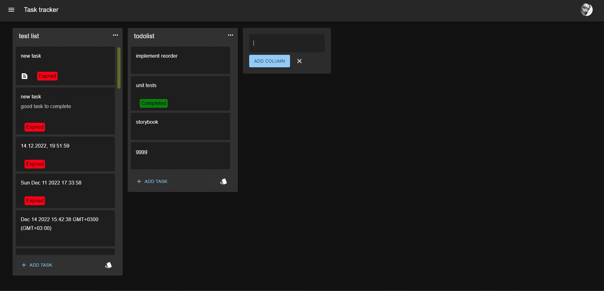
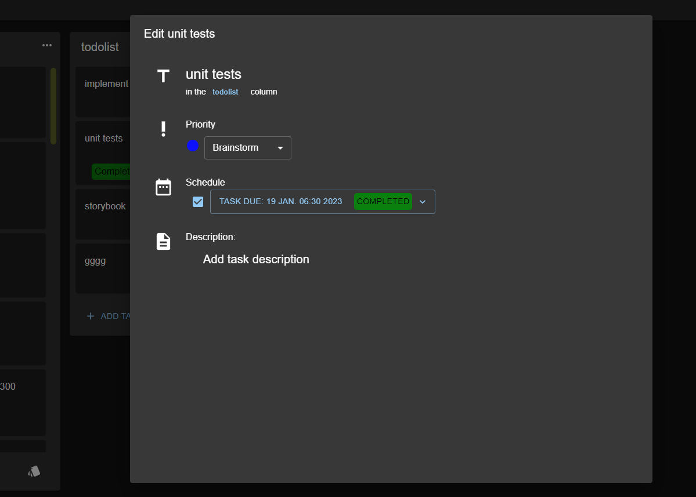

# <h1 align="center">Task tracker</h1>

## 
Yet another todo app.

## Screenshots

[//]: # (![app main page]&#40;public/app-main-page.png&#41;)
[//]: # (![task edit dialog]&#40;public/task-edit-dialog.png&#41;)

    
    

## Environment Variables

To run this project, you will need to add the following environment variables to your .env file

`VITE_API_KEY`

`VITE_BASE_URL`

`VITE_SOCIAL_NETWORK_BASE_URL`

API website: https://social-network.samuraijs.com/

## Built with

 
 

